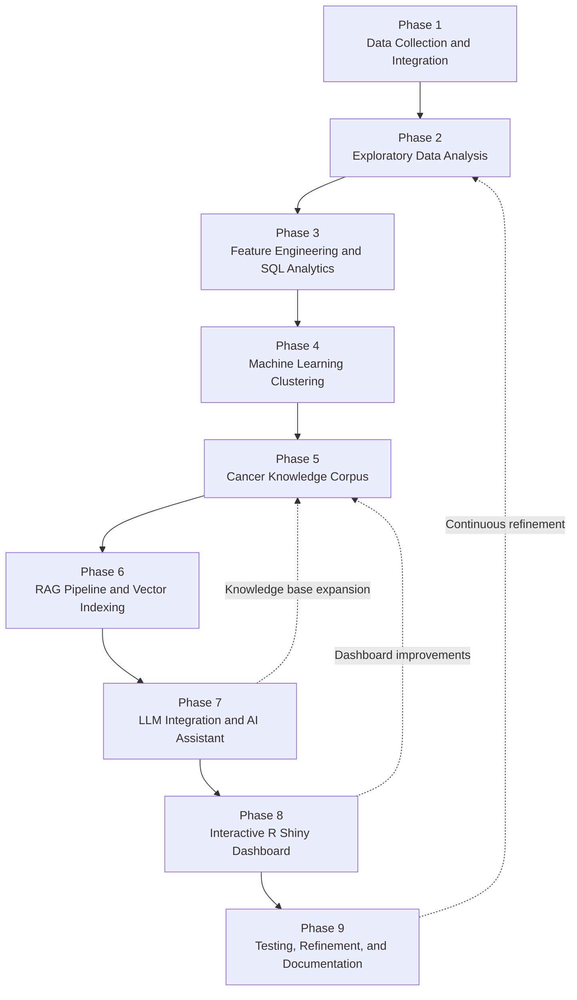

# AI-Powered Cancer Burden Analytics Platform

## Project Motivation

Cancer remains one of the leading causes of morbidity, mortality, and healthcare expenditure in the United States, making it important to identify cancers with the greatest overall burden through integrated data analysis. Traditional cancer statistics often examine incidence, mortality, or survival independently. This project combines clinical outcomes, healthcare expenditures, machine learning, and Retrieval-Augmented Generation (RAG) into a unified analytical platform to provide a more comprehensive assessment of cancer burden and support evidence-based exploration.

## Project Overview

Cancer remains one of the leading causes of mortality in the United States, yet critical information such as incidence, mortality, survival outcomes, healthcare expenditures, and research findings is often distributed across multiple independent data sources. This project integrates publicly available datasets from the CDC, SEER, and CMS into a unified analytics platform to provide a comprehensive assessment of cancer burden across nine major cancer types.

The project combines data engineering, SQL, Python analytics, machine learning, retrieval-augmented generation (RAG), and a large language model (LLM) within an interactive R Shiny dashboard. In addition to traditional data visualization, the platform includes an AI-powered Cancer Intelligence Assistant that enables users to ask natural language questions and receive evidence-based responses generated from both project data and curated cancer research documents.

## System Architecture

The following workflow illustrates how data moves through the platform, from data acquisition and integration to machine learning analysis, retrieval-augmented generation (RAG), AI-assisted question answering, and interactive visualization.

## Repository Structure

The repository is organized into modular components that separate datasets, analytical workflows, application development, and supporting resources. This organization improves maintainability, reproducibility, and ease of navigation.

<details>
<summary><strong>View Repository Structure</strong></summary>

```text
capstone-cancer-burden-analysis/
├── data/
├── notebooks/
├── postgresql/
├── Shinny_app/
├── rag_pipeline.py
└── README.md
```

</details>


### Directory Overview

- **data/** – Contains datasets, curated cancer knowledge documents, and supporting resources used throughout the project.
- **notebooks/** – Contains the primary project notebooks, including `Capstone_Project_Sivaraja.ipynb` for the end-to-end cancer burden analysis and RAG development, and `cancer_burden_ml.ipynb` for hierarchical clustering and machine learning analysis.
- **postgresql/** – Stores SQL scripts and database resources used for data integration and analytical queries.
- **Shinny_app/** – Contains the interactive R Shiny dashboard for visualizing cancer burden and AI-assisted exploration.
- **rag_pipeline.py** – Implements the retrieval-augmented generation (RAG) pipeline that powers the Cancer Intelligence Assistant.
- **README.md** – Provides project documentation and usage instructions.

## Data Sources

This project integrates both structured healthcare datasets and a curated evidence-based cancer knowledge corpus to support statistical analysis, machine learning, and AI-assisted question answering. While the structured datasets quantify cancer burden, the curated knowledge corpus provides reliable clinical and research evidence that grounds responses generated by the Retrieval-Augmented Generation (RAG) pipeline.

### Structured Healthcare Datasets

| Data Source | Contribution to the Project |
|-------------|-----------------------------|
| **CDC United States Cancer Statistics (USCS)** | Provides cancer incidence and mortality rates used to quantify cancer burden across the United States. |
| **SEER (Surveillance, Epidemiology, and End Results) Program** | Provides five-year relative survival estimates used to evaluate long-term patient outcomes. |
| **CMS Cost of Cancer Care** | Provides healthcare expenditure estimates, including initial care, continuing care, and end-of-life costs. |

### Evidence Sources for the RAG Knowledge Base

| Evidence Source | Contribution to the Project |
|-----------------|-----------------------------|
| **American Cancer Society (ACS)** | Provides evidence-based information on cancer risk factors, screening, diagnosis, treatment, survivorship, and current cancer statistics. |
| **NIH PDQ (Physician Data Query)** | Provides peer-reviewed cancer treatment summaries and clinical guidance used to support reliable AI-generated responses. |
| **Cancer Facts & Figures 2025 (American Cancer Society)** | Provides current cancer statistics, prevention strategies, screening recommendations, and treatment information incorporated into the knowledge corpus. |
| **Annual Report to the Nation on the Status of Cancer, Part 2: Patient Economic Burden Associated With Cancer Care** | Provides research on the economic burden of cancer care, enriching the knowledge base with evidence related to healthcare costs and patient outcomes. |
| **Curated Cancer Knowledge Corpus** | Project-specific knowledge base manually compiled from authoritative public sources for the nine selected cancer types, providing the evidence retrieved by the RAG pipeline before generating responses. |

> **Why Retrieval-Augmented Generation (RAG)?**  
> Large language models can generate fluent responses, but they may also produce inaccurate or unsupported information. To improve the reliability of AI-assisted question answering, this project uses Retrieval-Augmented Generation (RAG), which retrieves relevant evidence from a curated knowledge corpus before generating a response. By grounding answers in authoritative cancer resources, the Cancer Intelligence Assistant provides responses that are more relevant, transparent, and evidence-based.

## Project Workflow

The Cancer Burden Analytics Platform was developed through an iterative, end-to-end data science workflow. Each phase built upon the previous stage, gradually expanding the project from data integration and exploratory analysis to machine learning, retrieval-augmented generation (RAG), and an AI-powered interactive dashboard.



*Throughout development, earlier phases were revisited whenever new datasets, analytical insights, or AI capabilities became available. This iterative approach enabled continuous refinement of the analytical framework, machine learning models, and evidence-based RAG system while maintaining consistency across the entire platform.*

## Technologies Used

The Cancer Burden Analytics Platform integrates modern data engineering, machine learning, generative AI, and interactive visualization technologies into a unified analytical framework.

| Project Component | Technologies | Purpose |
|-------------------|--------------|---------|
| **Database & Data Integration** | PostgreSQL, SQL | Integrate, manage, and query cancer datasets from multiple public data sources. |
| **Data Analytics** | Python, Pandas, NumPy | Data cleaning, preprocessing, exploratory data analysis, and statistical analysis. |
| **Machine Learning** | Scikit-learn | Hierarchical clustering and cancer burden pattern analysis. |
| **Interactive Dashboard** | R, Tidyverse, R Shiny | Interactive visualization, dashboard development, and user interaction. |
| **Retrieval-Augmented Generation (RAG)** | LangChain, Sentence Transformers, FAISS | Semantic document retrieval and evidence-based knowledge retrieval. |
| **Large Language Model (LLM)** | OpenRouter | Natural language question answering using evidence retrieved by the RAG pipeline. |
| **Development Environment** | Jupyter Notebook, Git, GitHub | Notebook development, version control, and repository management. |

## Key Features

- **Integrated Cancer Burden Database** – Combines CDC, SEER, and CMS datasets into a unified PostgreSQL database for comprehensive cancer burden analysis.

- **Comprehensive Cancer Burden Analytics** – Examines incidence, mortality, five-year survival, mortality-to-incidence ratios, healthcare expenditures, and diagnosis challenges across nine major cancer types.

- **Machine Learning-Based Cancer Clustering** – Applies hierarchical clustering to identify groups of cancers with similar burden characteristics, supporting comparative analysis and interpretation.

- **Evidence-Based RAG Pipeline** – Retrieves relevant information from a curated cancer knowledge corpus before generating responses, improving the reliability and transparency of AI-assisted question answering.

- **AI-Powered Cancer Intelligence Assistant** – Enables users to ask natural language questions and receive evidence-based answers generated from both project data and authoritative cancer resources.

- **Interactive R Shiny Dashboard** – Integrates statistical analysis, machine learning, healthcare cost visualization, and AI-assisted exploration into a unified interactive web application.

- **End-to-End Data Science Workflow** – Demonstrates the complete lifecycle of a modern data science project, including data engineering, SQL integration, machine learning, generative AI, and interactive dashboard development.

## Project Results

The AI-Powered Cancer Burden Analytics Platform successfully integrates multiple national healthcare datasets, machine learning, and retrieval-augmented generation (RAG) into a unified analytical framework for cancer burden assessment and evidence-based exploration.

### Key Achievements

- Successfully integrated CDC, SEER, and CMS datasets into a unified PostgreSQL database.
- Developed a comprehensive analytical framework for evaluating cancer burden across nine major cancer types.
- Identified three distinct cancer burden clusters using hierarchical machine learning.
- Built an evidence-based RAG pipeline using a manually curated cancer knowledge corpus from authoritative public sources.
- Developed an AI-powered Cancer Intelligence Assistant capable of answering natural language questions using retrieved evidence and project data.
- Delivered an interactive R Shiny dashboard that combines statistical analysis, machine learning, healthcare cost visualization, and AI-assisted exploration within a single application.

## Future Opportunities

The AI-Powered Cancer Burden Analytics Platform establishes a foundation for future research and development. Potential extensions include:

- Expand the analytical framework to include additional cancer types and longitudinal outcome analyses.
- Incorporate demographic, geographic, and socioeconomic factors to support more comprehensive population-level cancer burden assessments.
- Enhance the evidence-based knowledge corpus with additional clinical guidelines, peer-reviewed literature, and emerging cancer research.
- Develop an AI agent capable of autonomously retrieving information, querying structured databases, analyzing results, and generating evidence-based insights from multiple data sources.
- Deploy the platform as a cloud-based web application to improve accessibility, scalability, and collaborative use.

## Connect

For additional information about this project or future collaborations:

- **LinkedIn:** https://www.linkedin.com/in/sivaraja-vaithiyalingam
- **GitHub:** https://github.com/dhansiv-stack

## Acknowledgments

This project was completed as the capstone project for the Data Science Bootcamp at Nashville Software School.

The author gratefully acknowledges the publicly available datasets and evidence-based resources provided by the Centers for Disease Control and Prevention (CDC), the Surveillance, Epidemiology, and End Results (SEER) Program, the Centers for Medicare & Medicaid Services (CMS), the American Cancer Society (ACS), and the National Cancer Institute's Physician Data Query (NIH PDQ), which formed the foundation of this work.

Special thanks to my instructor and peers at Nashville Software School for their guidance, encouragement, and support throughout the development of this project.


